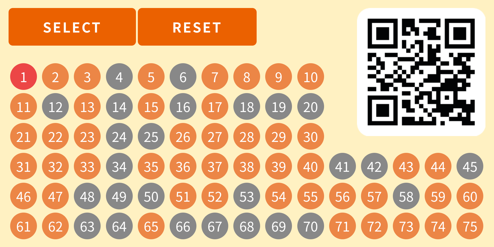

# BINGO!

author
:   Shugo Maeda

# Self introduction

* President of NaCl (Network Applied Communication Laboratory Ltd.) since Dec 2022

# Lottery at a year-end party

{:relative_height='90'}

# Bingo card

{:relative_height='90'}

# Bingo machine

{:relative_height='90'}

# Demo

# Bingo card implementation

* Rails
* ruby.wasm

# Initialization

```html
<script type="text/ruby">
  require "js"

  srand(<%= @seed %>)

  def document = JS.global[:document]

  CARD = (1..75).each_slice(15).map { |i| i.sample(5) }.transpose
  CARD[2][2] = ""
```

# Acknowledgement

{:relative_height='90'}

# Bingo card specification

|Row B|Row I|Row N|Row G|Row O|
|-----|-----|-----|-----|-----|
|(1..15).sample(5)|(16..30).sample(5)|(31..45).sample(5)|(46..60).sample(5)|(61..75).sample(5)|

* The center space is free

# Using Promise on ruby.wasm

* synchronous code by Fiber

```ruby
def sleep_ms(ms)
  JS.eval("return new Promise((f) => setTimeout(f, #{ms}))").await
end

3.times do
  # do something
  sleep_ms(5000)
end
```

# rubyVM.evalAsync

```html
<script type="text/ruby">
  def update_loop
    ...
  end
</script>
<script type="text/javascript">
  // Promise#await works only under evalAsync
  await window.rubyVM.evalAsync("update_loop")
</script>
```

# SystemStackError

```javascript
await window.rubyVM.evalAsync("p (0..3).all? { |i| i.even? }")
```

# Fiber stack size is 256kb

* https://github.com/ruby/ruby.wasm/issues/133

> evalAsync internally uses Fiber, and its stack size 256kb is smaller than main stack (16mb).

# Loop unrolling by ERB

```
<%
  is_bingo = [
    *(0..4).map { |i| (0..4).map { |j| "selected[#{i}][#{j}]" }.join("&&") },
    *(0..4).map { |i| (0..4).map { |j| "selected[#{j}][#{i}]" }.join("&&") },
    (0..4).map { |i| "selected[#{i}][#{i}]" }.join("&&"),
    (0..4).map { |i| "selected[#{i}][#{4-i}]" }.join("&&")
  ].join("||")
%>
  if <%== is_bingo %>
    ...
```

# Conclusion

* ruby.wasm is awesome
